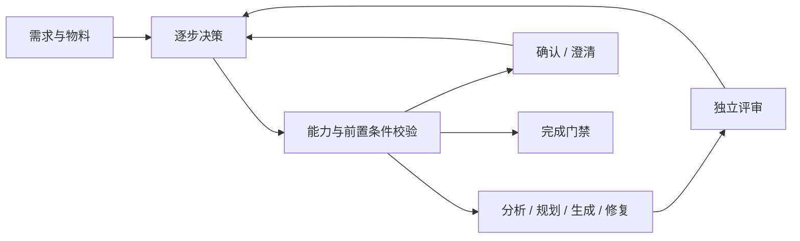

# CaseForge

面向测试用例生成的 Agentic Harness 演示项目。保留测试业务工作流，由 Supervisor 根据需求物料、已有产物和评审反馈动态选择 Agent、Skill 和下一步动作。

内置知识包是**完全虚构的设备借用申请**，优惠券需求也是合成测试。示例接口和事件不对应任何真实组织或服务，不包含业务原始文档、凭证或运行数据。

## 核心能力

- 动态编排：结构化动作、能力白名单、前置条件、人工模块确认、反馈重规划和可恢复暂停。
- 质量控制：生成与独立评审分离，区分缺陷、待澄清项和可选建议；修复后必须复评，无进展或两轮后仍有阻塞项时暂停。
- 输出可靠性：严格 JSON 解析、流式进度、错误分类；评审 JSON 格式失败最多重试一次，评审不完整不能通过门禁。
- Memory：作用域隔离、事实化存储、版本替换、冲突与失效处理，保留反馈和决策来源。
- 知识检索：关键词与向量混合召回、父子分块、证据追踪、知识版本与领域隔离。
- 可观测性：Agent/LLM/Tool Trace、耗时、Token 用量、降级与动作观察记录。
- 工作台：需求解析、模块编辑、用例采纳/修改/拒绝、CSV/JSON/XMind 导出、公开数据集评测。
- 人工验收绑定用例正文版本；采纳示例仅在来源项目内复用，正文修改或拒绝后自动停用旧示例，历史降级与当前验收分别显示。升级及旧数据处理见 [人工验收与示例生命周期](docs/agentic-harness.md#人工验收与示例生命周期2026-09-28)。



## 本地启动

需要 Python 3.10 或更高版本。在项目目录执行：

```powershell
python -m venv .venv
.\.venv\Scripts\Activate.ps1
python -m pip install -r requirements.txt
Copy-Item .env.example .env
python run.py
```

打开 <http://127.0.0.1:8765>。没有模型密钥时可运行确定性的离线演示；它不代表模型自主决策效果。

在本地 `.env` 配置兼容 OpenAI Chat Completions 的服务。默认示例为 GLM，真实调用需要你自己的密钥并可能产生费用。不要将 `.env` 提交到 Git。详见 [GLM 配置](docs/glm-5.3.md)。

原有本地数据与公开示例不自动混用。从旧工作区试用新示例时，可以在启动前设置全新目录：

```powershell
$env:CASEFORGE_DATA_DIR = "$PWD\data\public-demo"
python run.py
```

PDF 原生文本提取需要 `pdftotext`；可选 OCR 依赖见 `requirements-ocr.txt`。普通文本示例无需 OCR。运行产物存入 `data/`，整目录被 Git 忽略。

## 测试与评测

隔离离线回归，不加载真实模型凭证：

```powershell
python tests/run_offline.py
```

内置 `EQUIPMENT-BASELINE-V1` 和 `EQUIPMENT-RAG-V1` 是合成回归样例；它们验证代码行为，不是外部权威评测。公开 Benchmark 适配器按需下载外部数据，并记录来源与许可；数据不随仓库发布。

真实模型的优惠券 smoke test 需主动执行：

```powershell
python tests/manual_agentic_smoke.py --stream --model glm-5.3 --reasoning-effort low
```

遇到模块确认或业务澄清时按脚本输出处理。参数见 [Agentic Harness](docs/agentic-harness.md)。

## 源码入口

| 文件 | 作用 |
| --- | --- |
| `app/supervisor.py` | 动作选择、前置条件、预算及完成门禁 |
| `app/agents.py` | Worker、检索、生成、评审与修复 |
| `app/review_policy.py` | 评审分类、阻塞规则和问题历史 |
| `app/orchestrator.py` | 业务编排、产物保存及人工反馈 |
| `app/adaptive_memory.py` | 长期记忆及生命周期 |
| `app/domain_equipment.py` | 新编写的虚构设备借用知识包 |
| `app/api.py`、`app/static/` | FastAPI 与工作台 |

## 边界与发布说明

这是本地研究与演示项目。当前互斥依赖单进程锁，不提供生产环境鉴权、分布式执行或进程崩溃后的可靠动作重放。请仅绑定本机使用；模型评审分数不替代人工业务验收。

历史验证与失败事实保留在 [修复日志](docs/fix-log.md)。本地运行证据不随公开仓库发布；旧领域标识已概括化，历史实测不等于新示例的真实模型评测。

发布范围与检查方法见 [公开发布说明](docs/public-release.md)。仓库尚未选择开源许可证；公开可见不代表已经授予开源许可。
