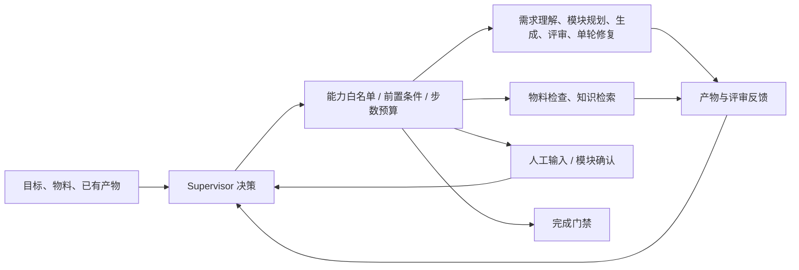

# Agentic Harness 第一阶段

这一阶段在现有业务 Worker 上增加逐步决策的 Supervisor。模型每次输出一个结构化动作，运行时校验并执行后，将结果交回模型重新选择下一步。已有分析、模块和用例可以直接复用，模型也可以选择补查证据、定向生成或询问用户。



## 使用

1. 新建项目选择“创建并交给 Agentic”；已有项目可以填写目标后“启动 Agentic 生成”。
2. 查看运行记录中的决策、理由、Skill 和执行观察。
3. 到达模块确认点后，在模块工作区检查、调整并确认模块树，再点击“继续本次运行”。
4. 如果 Supervisor 询问业务问题，填写补充说明后继续。目标和回答会进入后续 Worker 的上下文。

模型配置沿用现有 LLM 客户端，不引入新框架依赖。无模型时运行 `deterministic` 离线规则演示；有模型时运行 `model`。Supervisor 模型调用失败会显式终止；Worker 沿用原有回退机制，但回退会在运行记录显示，即便评审通过也标记为 `needs_attention`。

## 能力与门禁

| 能力 | 用途 | 前置条件 |
| --- | --- | --- |
| `inspect_materials` | 检查上传文档类型、提取警告及文本片段 | 任意阶段 |
| `search_knowledge` | 检索领域知识，证据传递给后续 Worker | 提供查询 |
| `requirement_understanding` | 需求分析 | 没有分析和下游产物 |
| `module_planning` | 初始模块规划及内部模块质量检查 | 有分析，无模块/用例 |
| `case_generation` | 用指定 Skill 生成、追加、定向或对话修改 | 已确认非空模块树；有用例时禁止 full |
| `quality_critic` | 独立用例评审 | 已确认模块树和用例 |
| `case_revision` | 消费 findings，单轮修复 | 本轮针对当前产物的有效评审、有可修复项 |

`case_revision` 复用现有生成 Agent 的修复策略，不新增独立角色，也不隐式再评审。Supervisor 必须再次选择评审能力。生成和修复需要明确的 Skill ID，指令实际进入 Worker 上下文。受 Supervisor 调度的生成不再运行内部关键词选 Skill 的研究循环，原有 RAG/Memory 上下文仍保留。Skill 是测试策略，不是独立进程；离线模板仍保留模块本身要求的用例类型。

模型不能自动确认模块，也不能重置已有分析和模块。结束时必须具备已确认模块、非空用例和本轮针对当前产物的有效评审；不能遗留阻塞 finding。产物指纹变化或新用户说明会使当前评审凭证失效。仅回复“已同意”不能绕过确认接口。

### 评审分类与收敛控制（2026-09-23）

Critic 接收原始需求、项目背景、完整需求分析、运行目标和用户回答、评审重点，以及最近 4 次有效评审和问题台账。模型必须引用原文依据，并按以下类型处理语义发现：

| `disposition` | 含义 | 行为 |
| --- | --- | --- |
| `defect` | 有依据的执行错误或需求矛盾 | 阻塞，可定向修复 |
| `clarification` | 契约或判断依据缺失 | 阻塞，暂停请求业务澄清，不自动编造代理断言 |
| `suggestion` | 可选的去重、表达等优化 | 保留在报告，不自动返修，不阻止完成 |
| `legacy` | 旧报告没有分类字段 | 保留原有严格门禁，重新评审后才使用新分类 |

引用无法在输入原文中找到、需求 ID 无效或分类未知时，改为待澄清；格式错误或语义评审失败产生 `review_incomplete`。原文匹配只证明引用存在，不证明模型判断正确。high/critical/error 始终阻塞，模型不能通过标成建议豁免高风险；结构覆盖门禁也继续保留。评分仍展示所有发现的扣分，完成条件由阻塞项决定，不以分数阈值代替验收。

运行记录新增 `issue_ledger`、`review_history`、`repair_rounds`。问题按类别、用例/模块和问题类型聚合为稳定的问题组，记录再次出现和阻塞分类变化；聚合不等于精确识别相同缺陷。某轮未发现旧问题仅标记 `not_observed`，不宣称已证明关闭。旧运行在续跑时从成功评审步骤恢复最近的历史，不授予新鲜评审凭证。前端可查看分类、依据及问题跟踪。

每次用户补充后的自动修改最多尝试 2 轮（已有用例的生成/对话修改也计入）。复评发现待澄清项、评审未完成、修改后产物未变化，或两轮后仍有阻塞项时，运行时直接暂停并列出问题，无需模型再花一步提问。单纯增加步数不会重置修复计数；非空用户回答会开启新一轮并使旧评审凭证失效。此限制只约束 Supervisor，单独调用修复接口仍由调用方控制。该机制限制重复消耗，不保证两轮内修好所有缺陷，也不能自动裁定全部矛盾建议。

评审技术失败与业务澄清分开处理：`review_incomplete` 仍暂停为 `waiting_input` 以便原运行续跑，但该步骤标为 `error`，清除新鲜评审凭证，填入 `run.error`，在 observation 中记录 `convergence_stop=review_failed`、安全错误分类和剩余步数。`output_limit` 表示模型输出长度限制，追加决策步数不能解决它。调整调用配置后回复重试即可；有剩余步数时不需要 `additional_steps`。失败评审不会加入有效问题历史。

Critic 的 `invalid_json` 有一次有界格式重试：使用相同完整输入和 schema 提示，强调只输出一个 JSON 对象。所有可执行发现必须放入 findings，禁止尾部说明；第二次仍失败则暂停。每次评审最多 2 次模型请求，仍占 1 个 Supervisor 动作，模型调用数和费用可能增加，脚本 calls 和 LLM trace 记录每次尝试。超时、长度截断、请求失败及业务澄清不触发此重试。schema 由现有客户端加入提示词，不是服务端强制结构化输出保证；严格解析和业务校验继续执行，不能截取首个 JSON 丢弃额外结论。

参数错误、前置条件拒绝和评审反馈会作为下一次决策的 observation；模型可换能力、换参数或请求输入。未知能力/Skill 被拒绝，相同状态下重复成功动作也会被拒绝。模型生成的用例调整指令不会自动提取为长期用户决策 Memory；业务产物的会话和版本快照继续保留。

## 持久化与 API

`data/agent_runs/AR-*.json` 独立保存目标、模式、状态、每步决策与观察、暂停问题、用户回答和评审指纹。暂停后重新读取项目再决策，预算累计计算。Trace 增加 `supervisor.decide`、能力调用 span 和 `supervisor.step` event。

| API | 用途 |
| --- | --- |
| `GET /api/agent-capabilities` | 能力契约 |
| `POST /api/projects/{id}/agent-runs` | 启动，参数 `goal`、`max_steps` |
| `GET /api/projects/{id}/agent-runs` | 项目运行历史 |
| `GET /api/projects/{id}/agent-runs/{run_id}` | 决策与观察明细 |
| `POST /api/projects/{id}/agent-runs/{run_id}/continue` | 人工确认/补充后继续，参数 `answer`、`additional_steps` |

初始默认最多 12 次决策，允许 1–20。继续暂停或预算耗尽的运行时，可显式提供 `additional_steps`（默认 0，单次 0–20，累计最多 100）；追加记录保存在 `budget_extensions`。没有剩余预算且不追加时，接口拒绝执行并保留暂停状态。拒绝、人工暂停和结束动作也占步数，提问本身不能授权追加预算，也不能豁免质量门禁。此预算不等同于底层 LLM 调用数或 Token 预算；需求和模块 Worker 可能有内部研究/质量检查。

修复现在支持评审点名用例的 `semantic` 问题，可修改前置条件、动作、测试数据及断言；仍禁止删除已有用例、改变模块归属或丢失原需求映射和人工状态。未被点名的用例保留原内容，纯断言修复仍不允许改动作。中文用例类型和已知英文别名在模型载入时统一成标准标签，旧项目及历史快照也适用；不认识的自定义类型保留。

继续 2026-09-20 的合成测试（真实模型调用，先复评，再按反馈修复和复评）：

```powershell
python tests/manual_agentic_smoke.py --root data/live_smoke/glm-20260920-130433 --continue-run --additional-steps 8 --answer "修复评审发现的问题，保持3模块10条用例，修复后重新评审；不要接受仍有阻塞问题的结果。"
```

脚本复用现有项目及运行，不重复需求分析或模块规划；覆盖续跑报告前会保存带时间戳的旧报告。此次代码回归使用模拟模型，未自动发起上述付费调用。

如果运行因请求超时变为 `failed`，使用 `--restart-run` 代替 `--continue-run`，从现有产物新建运行；旧运行保留，ID 记录在 manifest 的 `previous_run_ids`。新运行用 `--max-steps 8` 设置预算，不能使用 `--additional-steps`。可通过 `--timeout-seconds 360` 临时提高本次测试的请求超时，不修改 `.env`；该值不是全流程时限，也不能保证请求成功。重启报告保存到 `report-restart.json`。暂停状态应续跑，不允许通过此参数另起运行。

同项目 HTTP 写操作、WebSocket 生成和 Supervisor 在单进程内互斥，不同项目可独立运行。运行记录按项目隔离；列表和详情可在运行期间读取。

## 当前边界与验证

这是同步请求内的第一阶段控制循环，支持已落盘人工暂停点的恢复。尚不提供后台任务队列、进程崩溃后的动作重放、多进程分布式锁或并行 Agent 调度。文档解析/OCR 仍在上传阶段完成，Supervisor 检查的是解析后的物料。

终止或遗留 `running` 记录不能直接续跑；确认无执行中的请求后，可从当前产物发起新运行。`budget_exhausted` 可以通过显式追加预算续跑。第一次上线建议单个服务进程；质量分数并不替代人工业务验收。

核心代码：`app/supervisor.py`、`app/supervisor_models.py`。`tests/test_supervisor.py` 使用离线 Worker 和脚本/反馈驱动的模拟模型验证协议、反馈重规划、Skill 传递、门禁、持久化、隔离和 API；这类回归不能证明真实模型的业务选择质量。

第一阶段上线验证：88 项自动化测试通过（含新增 15 项 Supervisor 测试），JavaScript 语法检查通过。隔离数据目录下的浏览器操作已跑通创建、暂停、确认、继续和完成，控制台无错误。

2026-09-23 评审收敛修复的回归范围包括上下文传递、建议与澄清门禁、高风险保护、旧记录兼容、问题再次出现、无变化和两轮修复暂停。此次为隔离数据与模拟模型验证，未追加真实模型请求；此前真实调用不能证明新策略已通过完整业务验收。具体结果见 [修复日志 FIX-007](fix-log.md)。
